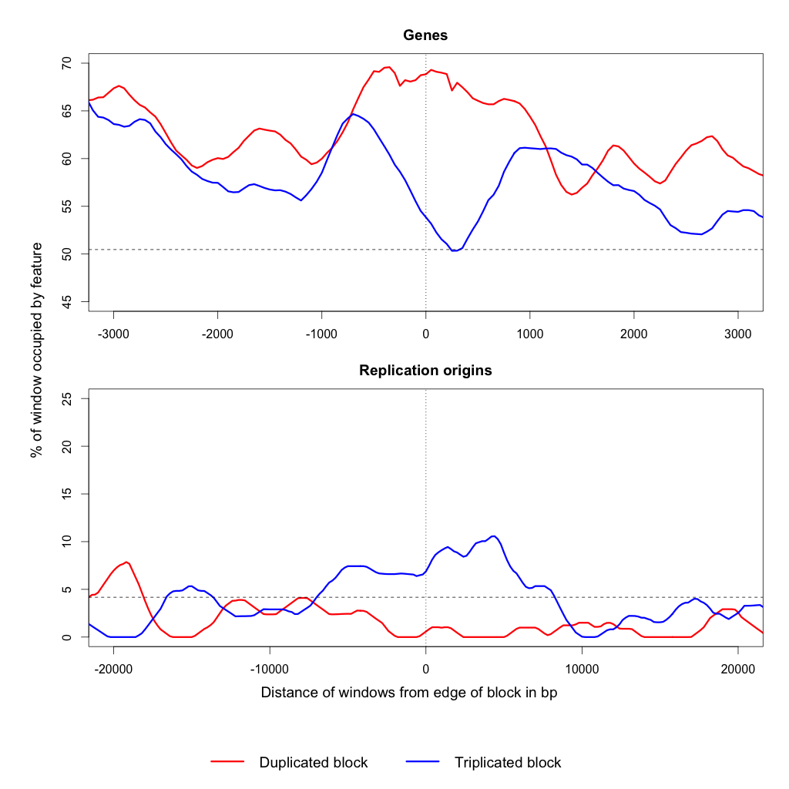
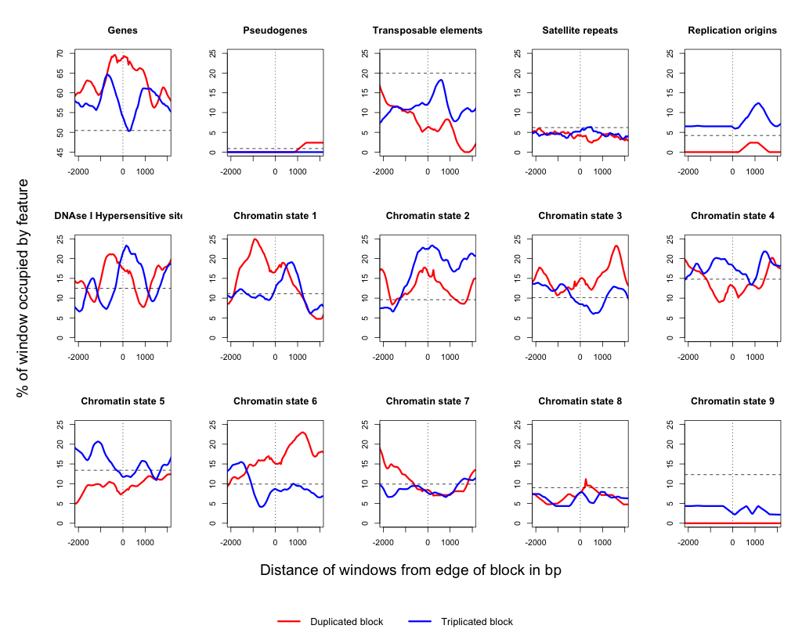

[](http://dx.doi.org/10.5281/zenodo.13237)

# FRAG_project #

## Overview ##

This directory contains code and data files for the Fragmentation project, investigating shattered 
chromosome phenotypes in _Arabidopsis thaliana_. The original focus of this repository
is to develop code to help determine breakpoints between duplicated and triplicated
regions of chromosomes (see [Block_detection_code/README.md](Block_detection_code/README.md)) 
but the focus shifted to write code that will see whether certain genomic features are 
over- or under-represented at either the breakpoint regions or in the blocks themselves.
	

## Generating Data: Making Master GFF file of all genomic features ##

### 1) Get GFF features from TAIR ###

TAIR has separate GFF files for various features on their FTP site (not all in one 
master file). So:

```bash
cat TAIR10_GFF3_genes_transposons.gff TAIR_GFF3_ssrs.gff > all_TAIR10_features.gff
```
	


### 2) Making replication origin GFF file ###

I wrote a simple script `ori2gff.pl` that takes the raw data from the Gutierrez et al.
paper and converts it to a GFF format. E.g. 	

```bash
./ori2gff.pl Gutierrez.txt > Gutierrez_DNA_replication_origin_TAIR10_GBROWSE.gff
```
	
This file will be appended to the main TAIR10 GFF file of all genomic features.

```bash
cat Gutierrez_DNA_replication_origin_TAIR10_GBROWSE.gff  >> all_TAIR10_features.gff
```


### 3) Making DNAse I hypersensitive site GFF file ###

This paper by Zhang et al. (2012) describes a set of hypersensitive sites in A. thaliana:

[Genome-Wide Identification of Regulatory DNA Elements and Protein-Binding Footprints 
Using Signatures of Open Chromatin in Arabidopsis](http://www.plantcell.org/content/24/7/2719.full)

In this paper, they generate DHS maps for seed and flower tissues. These data were 
submitted to the GEO database and are available under accession 
[GSE34318](http://www.ncbi.nlm.nih.gov/geo/query/acc.cgi?acc=GSE34318). One of the data 
files in in BED format (GSE34318_dhsites_region.bed) and this includes the location of 
DHS regions (presumably after some threshold value has been exceeded) for both leaf and 
seed tissues.

I extracted just the DHS regions that were identified in wildtype leaf libraries, and 
converted to GFF.

First quick replacement of spaces with tabs in downloaded bed file and then convert to 
desired GFF format with simple Perl script:

```bash
tr ' ' '\t' < GSE34318_dhsites_region.bed  | grep wtleaf | sort -k 1,1 -k 2n,2n  > GSE34318_dhsites_region_sorted.bed
./bed2gff.pl GSE34318_dhsites_region_sorted.bed  > DHS.gff
```
	
Now combine with main file:

```bash
cat DHS.gff >> all_TAIR10_features.gff
grep -vE "^#" all_TAIR10_features.gff | sort -k 1,1 -k 4n,4n  all_TAIR10_features.gff > tmp.gff; mv tmp.gff all_TAIR10_features.gff	
```


### 4) Making Chromatin state information GFF file ###

This new paper by Sequeira-Mendes et al. (2014) describes a set of distinct chromatin 
states in *A. thaliana*: 

[The Functional Topography of the Arabidopsis Genome Is Organized in a Reduced Number of 
Linear Motifs of Chromatin States](http://www.plantcell.org/content/early/2014/06/11/tpc.114.124578.long)

They mostly use existing histone and other epigenetic modification data, but have some of
their own. Using principal components analysis, they end up defining 9 different states
of chromatin. These are available in supplemental data file 2 (Excel spreadsheet).

I converted this to a GFF file. Sequence Ontology only has one term for chromatin
(SO:0001747 open_chromatin_state) so I will use the 9th column of GFF to distinguish the
9 different states.

First export each tab in Excel spreadsheet to a text file (Windows formatted text), e.g
state1.txt, state2.txt etc. Then simple Perl script to convert them to GFF.

```bash
./chromatin_state2gff.pl > tmp.gff
cat tmp.gff >> all_TAIR10_features.gff
sort -k 1,1 -k 4n,4n  all_TAIR10_features.gff > tmp.gff; mv tmp.gff all_TAIR10_features.gff	
```

### Summary of TAIR10 GFF data ###

How many unique features do we have?

```bash
cut -f 2,3 all_TAIR10_features.gff | sort -u
GEO     DNAseI_hypersensitive_site
GutierrezLab    DNA_replication_origin
Sequeira-Mendes_2014_paper      open_chromatin_state
TAIR10  CDS
TAIR10  chromosome
TAIR10  exon
TAIR10  five_prime_UTR
TAIR10  gene
TAIR10  miRNA
TAIR10  mRNA
TAIR10  ncRNA
TAIR10  protein
TAIR10  pseudogene
TAIR10  pseudogenic_exon
TAIR10  pseudogenic_transcript
TAIR10  rRNA
TAIR10  snoRNA
TAIR10  snRNA
TAIR10  three_prime_UTR
TAIR10  transposable_element
TAIR10  transposable_element_gene
TAIR10  transposon_fragment
TAIR10  tRNA
TandemRepeatsFinder_v4.04       satellite
```

Can reorder master GFF file to sort by chromosome and then coordinate:

```bash
(sort -k1,1 -k4n,4n all_TAIR10_features.gff  > tmp) && mv tmp all_TAIR10_features.gff
```


## Generating a GFf file to represent experimental data ##


### Nomenclature and GFF data formats used to represent breakpoint/block data ###

To summarize, we have regions of the genome that have been identified as representing 
duplicated (or triplicated) 'blocks'. We can represent these regions by using the Sequence 
Ontology term 'copy_number_gain' (SO:0001742):

<http://www.sequenceontology.org/browser/current_svn/term/SO:0001742>

Each duplicated or triplicated block — henceforth referred to as either 2x or 3x for
simplicity — has two ends which define breakpoints. These can be represented with the
Sequence Ontology term 'chromosome_breakpoint' (SO:0001021):

<http://www.sequenceontology.org/browser/current_svn/term/SO:0001021>

Each breakpoint has a connected breakpoint (the end of another 2x/3x block). In most
cases these pairs of breakpoints will contain intervening sequence that is not present
in the reference. Collectively, a pair of breakpoints (and inserted sequence) defines a 
junction. These could potentially also be represented in Sequence Ontology terms with
'insertion_site' (SO:0000366):

<http://www.sequenceontology.org/browser/current_svn/term/SO:0000366>

Finally, there are also the regions of the genome that punctuate 2x and 3x blocks and which
can be thought of as unduplicated regions, or '1x' blocks. These can be represented with
the Sequence Ontology term 'region' (SO:0000001):

<http://www.sequenceontology.org/browser/current_svn/term/SO:0000001>


### Making a new GFF file ###

We now need anonymous (and unique) identifiers for blocks and breakpoints. E.g. block0001, 
breakpoint0001 etc. Each block (copy_number_gain) should connect to two breakpoint objects, 
and each breakpoint should have a parent block ID, and a paired breakpoint ID. Both blocks 
and breakpoints will be stored in a single GFF file. 

Example GFF file:


	##gff-version 3
	##species http://www.ncbi.nlm.nih.gov/Taxonomy/Browser/wwwtax.cgi?mode=Info&id=3702
	##genome-build TAIR TAIR10
	#Data from A. thaliana line FRAG00062
	#Generated 20140402
	Chr1	t_test.pl	copy_number_gain	1	205575	.	+	.	ID=block0001;Name=01a1_01a2;Note="duplicated block"
	Chr1	PRICE	chromosome_breakpoint	1	1	.	.	.	ID=breakpoint0001;Parent=block0001;Name=01a1;Note="telomeric end"
	Chr1	PRICE	chromosome_breakpoint	205575	205575	.	-	.	ID=breakpoint0002;Parent=block0001;Name=01a2;Note="paired with breakpoint0033"
	Chr1	t_test.pl	copy_number_gain	31632	87466	.	+	.	ID=block0002;Name=01b1_01b2;Note="triplicated block"
	Chr1	PRICE	chromosome_breakpoint	31632	31632	.	-	.	ID=breakpoint0003;Parent=block0002;Name=01b1;Note="paired with breakpoint0087"
	Chr1    .       region  205575  458539  .       +       .       ID=block0091;Note="no copy number gain detected"


### Treating FRAG00062 data by copy-number level ###

For FRAG00062 we can also separate out the breakpoint data into two subsets, those 
breakpoints that flank either 2x or 3x blocks:

```bash
grep duplicated FRAG00062.gff   | sed 's/.*ID=\(block[0-9]*\);N.*/\1/' > duplicated_blocks.txt
grep triplicated FRAG00062.gff  | sed 's/.*ID=\(block[0-9]*\);N.*/\1/' > triplicated_blocks.txt
grep -f duplicated_blocks.txt FRAG00062.gff > FRAG00062_2x.gff
grep -f triplicated_blocks.txt FRAG00062.gff > FRAG00062_3x.gff
```


## Analysis: part 1 — Collect some background information about the genome ##


### Checking feature orientation ###

At this point we realized that we would like to know whether the enrichment of genes 
inside junction regions followed any pattern. I.e. are there more likely to be convergently
transcribed genes (hence more 3' UTRs) than divergently or tandemly transcribed genes.

I put only gene features from all_TAIR10_feature.gff into a new file (genes.gff) and made
a new script to test this. Running this script with newer breakpoint data for FRAG00062 
(90 breakpoints, excluding the 2 that meet telomeres):

```bash
./check_feature_orientation.pl --breakpoint_gff GFF_files/FRAG00062.gff --feature_gff GFF_files/genes.gff --target gene

>>>|>>>	25	%27.78
<<<|<<<	31	%34.44
>>>---|---<<<	4	%4.44
<<<---|---<<<	8	%8.89
<<<---|--->>>	14	%15.56
>>>---|--->>>	8	%8.89
```


Breakpoints inside genes account for 62% of all breakpoints (56/90) and those that are inside
divergently transcribed genes account for 41% of all intergenic breakpoints (14/34).

And for FRAG00045 (30 breakpoints):

```bash
./check_feature_orientation.pl --breakpoint_gff FRAG00045.gff --feature_gff genes.gff --target gene

>>>|>>>	12	%40.00
<<<|<<<	5	%16.67
>>>---|---<<<	3	%10.00
<<<---|---<<<	3	%10.00
>>>---|--->>>	5	%16.67
<<<---|--->>>	2	%6.67
```

This time only 57% of breakpoints were inside genes (17/30) and only 15% of intergenic 
breakpoints are between divergently transcribed genes. So no strong pattern.


### Data on nearest feature to each breakpoint ###

I wrote a script to calculate the average distance of any genomic feature to each 
breakpoint. I.e. for every breakpoint find nearest gene/UTR/satellite etc. Then averaged
the nearest distances across all breakpoints. 

```bash
./nearest_feature.pl --breakpoint_gff GFF_files/FRAG00062.gff --feature_gff GFF_files/all_TAIR10_features.gff

Feature Average_distance_to_nearest_breakpoint  Standard_deviation      Number_of_features
CDS     879     2251    53113
DNA_replication_origin  44837   59143   376
DNAseI_hypersensitive_site      1507    2403    10187
chromosome      7407070 3791549 1
exon    567     1162    57589
five_prime_UTR  2325    3085    9224
mRNA    922     1194    9953
miRNA   257654  248174  49
ncRNA   108994  98485   149
non_protein_coding_gene 44618   33137   432
open_chromatin_state_1  3126    3856    3155
open_chromatin_state_2  2581    3245    3833
open_chromatin_state_3  3749    4999    3056
open_chromatin_state_4  2834    3494    4050
open_chromatin_state_5  9277    11084   1897
open_chromatin_state_6  5153    6944    2303
open_chromatin_state_7  12548   15714   1248
open_chromatin_state_8  27134   31662   1275
open_chromatin_state_9  343955  388532  468
protein 1169    2223    9271
protein_coding_gene     1194    2205    7092
pseudogene      116394  230257  233
pseudogenic_exon        116394  230257  327
pseudogenic_transcript  116394  230257  233
satellite       384     482     73112
snRNA   4342430 2745429 2
snoRNA  2116014 2467006 22
tRNA    158832  154954  236
three_prime_UTR 2039    2791    8185
transposable_element    6236    8143    7107
transposable_element_gene       131352  146540  681
transposon_fragment     6236    8143    7858
```

Results are probably biased towards higher density of certain features. I.e. breakpoints
are most likely to be nearest a satellite feature, but there are more satellite features
than anything else.


### Determine relative levels of enrichment of each feature across the genome ###

For the genome as a whole, and for the 1x, 2x, and 3x regions of Chr1 and Chr4, we can 
look to see what the levels of any genomic feature are:

```
	./determine_background_feature_enrichment.pl --feat GFF_files/all_TAIR10_features.gff --break GFF_files/FRAG00062.gff

	genome  CDS             33316212        27.96%
	genome  DNA_replication_origin          4968965 4.17%
	genome  DNAseI_hypersensitive_site              14889840        12.50%
	genome  exon            50129588        42.07%
	genome  five_prime_UTR          3147801 2.64%
	genome  gene            60130895        50.47%
	genome  mRNA            69108726        58.00%
	genome  miRNA           40072   0.03%
	genome  ncRNA           613554  0.51%
	genome  open_chromatin_state_1          13187250        11.07%
	genome  open_chromatin_state_2          11378100        9.55%
	genome  open_chromatin_state_3          12019350        10.09%
	genome  open_chromatin_state_4          17626350        14.79%
	genome  open_chromatin_state_5          15961650        13.40%
	genome  open_chromatin_state_6          11768100        9.88%
	genome  open_chromatin_state_7          11772450        9.88%
	genome  open_chromatin_state_8          10747500        9.02%
	genome  open_chromatin_state_9          14685000        12.33%
	genome  protein         51110375        42.90%
	genome  pseudogene              1028312 0.86%
	genome  pseudogenic_exon                879013  0.74%
	genome  pseudogenic_transcript          1028312 0.86%
	genome  rRNA            3944    0.00%
	genome  satellite               7378520 6.19%
	genome  snRNA           8491    0.01%
	genome  snoRNA          7339    0.01%
	genome  tRNA            43868   0.04%
	genome  three_prime_UTR         4944280 4.15%
	genome  transposable_element            23866665        20.03%
	genome  transposable_element_gene               9412571 7.90%
	genome  transposon_fragment             23276368        19.54%

	1x      CDS             2636947 30.64%
	1x      DNA_replication_origin          196512  2.28%
	1x      DNAseI_hypersensitive_site              1074764 12.49%
	1x      exon            3510277 40.78%
	1x      five_prime_UTR          231602  2.69%
	1x      gene            4764318 55.35%
	1x      mRNA            5020785 58.33%
	1x      miRNA           4257    0.05%
	1x      ncRNA           46150   0.54%
	1x      open_chromatin_state_1          907695  10.55%
	1x      open_chromatin_state_2          856514  9.95%
	1x      open_chromatin_state_3          846702  9.84%
	1x      open_chromatin_state_4          1612968 18.74%
	1x      open_chromatin_state_5          1500035 17.43%
	1x      open_chromatin_state_6          992130  11.53%
	1x      open_chromatin_state_7          983582  11.43%
	1x      open_chromatin_state_8          687027  7.98%
	1x      open_chromatin_state_9          220950  2.57%
	1x      protein         4072368 47.31%
	1x      pseudogene              74310   0.86%
	1x      pseudogenic_exon                68994   0.80%
	1x      pseudogenic_transcript          74310   0.86%
	1x      rRNA            0       0.00%
	1x      satellite               431066  5.01%
	1x      snRNA           175     0.00%
	1x      snoRNA          220     0.00%
	1x      tRNA            3535    0.04%
	1x      three_prime_UTR         372553  4.33%
	1x      transposable_element            1177628 13.68%
	1x      transposable_element_gene               303548  3.53%
	1x      transposon_fragment             1151380 13.38%

	2x      CDS             6022333 28.47%
	2x      DNA_replication_origin          856315  4.05%
	2x      DNAseI_hypersensitive_site              2812839 13.30%
	2x      exon            8818414 41.69%
	2x      five_prime_UTR          619332  2.93%
	2x      gene            10836987        51.24%
	2x      mRNA            12157720        57.48%
	2x      miRNA           31223   0.15%
	2x      ncRNA           159284  0.75%
	2x      open_chromatin_state_1          2436038 11.52%
	2x      open_chromatin_state_2          2186170 10.34%
	2x      open_chromatin_state_3          2186831 10.34%
	2x      open_chromatin_state_4          3096064 14.64%
	2x      open_chromatin_state_5          2896544 13.69%
	2x      open_chromatin_state_6          2258099 10.68%
	2x      open_chromatin_state_7          2082797 9.85%
	2x      open_chromatin_state_8          1736002 8.21%
	2x      open_chromatin_state_9          2482576 11.74%
	2x      protein         9191394 43.46%
	2x      pseudogene              176177  0.83%
	2x      pseudogenic_exon                163869  0.77%
	2x      pseudogenic_transcript          176177  0.83%
	2x      rRNA            26326   0.12%
	2x      satellite               1474852 6.97%
	2x      snRNA           26488   0.13%
	2x      snoRNA          27922   0.13%
	2x      tRNA            37825   0.18%
	2x      three_prime_UTR         936147  4.43%
	2x      transposable_element            3900552 18.44%
	2x      transposable_element_gene               1421188 6.72%
	2x      transposon_fragment             3798137 17.96%

	3x      CDS             324740  34.20%
	3x      DNA_replication_origin          43653   4.60%
	3x      DNAseI_hypersensitive_site              172685  18.19%
	3x      exon            414113  43.61%
	3x      five_prime_UTR          33160   3.49%
	3x      gene            572775  60.32%
	3x      mRNA            591478  62.29%
	3x      miRNA           3635    0.38%
	3x      ncRNA           3534    0.37%
	3x      open_chromatin_state_1          131759  13.88%
	3x      open_chromatin_state_2          144053  15.17%
	3x      open_chromatin_state_3          111564  11.75%
	3x      open_chromatin_state_4          148408  15.63%
	3x      open_chromatin_state_5          139260  14.67%
	3x      open_chromatin_state_6          113576  11.96%
	3x      open_chromatin_state_7          119057  12.54%
	3x      open_chromatin_state_8          48820   5.14%
	3x      open_chromatin_state_9          21285   2.24%
	3x      protein         492033  51.82%
	3x      pseudogene              6088    0.64%
	3x      pseudogenic_exon                6088    0.64%
	3x      pseudogenic_transcript          6088    0.64%
	3x      rRNA            3534    0.37%
	3x      satellite               48948   5.16%
	3x      snRNA           3534    0.37%
	3x      snoRNA          3534    0.37%
	3x      tRNA            4114    0.43%
	3x      three_prime_UTR         48485   5.11%
	3x      transposable_element            82989   8.74%
	3x      transposable_element_gene               22846   2.41%
	3x      transposon_fragment             82121   8.65%
```
        
So genes occupy about half of the genome.     


## Analysis: part 2 — look for enriched features around breakpoints ##

### Analysis of enriched features in breakpoint regions ###

If we define a 'breakpoint region' as a window of sequence around each breakpoint location
(mapped to the reference genome), we can ask whether any genomic features are enriched
in these breakpoint regions. E.g. take 1,000 bp around all breakpoints (potentially
overlapping other breakpoints) and ask whether the total bp of a feature such as 'mRNA' 
is higher (as a percentage) *inside* those regions vs all DNA *outside* those regions.

Can try this for many different sizes of breakpoint region (100 bp up to 10,000 bp). In 
this analysis certain GFF features (e.g. chromosome) are ignored. The final result is 
calculated as a ratio of %breakpoint-region-occupied-by-feature compared to
%non-breakpoint-region-occupied-by-feature. E.g.

```bash
./overlap_between_two_gff_files.pl --breakpoint_gff GFF_files/FRAG00062.gff  --feature_gff GFF_files/all_TAIR10_features.gff --bp 100

Run     Real_ratio      Bp      Feature Breakpoint_region_bp    Non_breakpoint_region_bp        Feature_bp_inside       %Inside Feature_bp_outside      %Outside        Shuffled_ratio  Above   Same    Below
0       1.1372  100     CDS     8957    30350564        2978    33.25   8873356 29.24   1.1372  0       0       0
0       0.9589  100     DNA_replication_origin  8957    30350564        300     3.35    1060090 3.49    0.9589  0       0       0
0       1.4907  100     DNAseI_hypersensitive_site      8957    30350564        1749    19.53   3975577 13.10   1.4907  0       0       0
0       1.1628  100     exon    8957    30350564        4324    48.28   12600559        41.52   1.1628  0       0       0
0       1.4412  100     five_prime_UTR  8957    30350564        361     4.03    848766  2.80    1.4412  0       0       0
0       1.1497  100     gene    8957    30350564        5428    60.60   15998341        52.71   1.1497  0       0       0
0       1.0995  100     mRNA    8957    30350564        5702    63.66   17572723        57.90   1.0995  0       0       0
0       0.0000  100     miRNA   8957    30350564        0       0.00    9336    0.03    0.0000  0       0       0
0       0.0000  100     ncRNA   8957    30350564        0       0.00    183696  0.61    0.0000  0       0       0
0       1.2536  100     open_chromatin_state_1  8957    30350564        1275    14.23   3446325 11.36   1.2536  0       0       0
0       2.0929  100     open_chromatin_state_2  8957    30350564        1910    21.32   3092404 10.19   2.0929  0       0       0
0       1.1439  100     open_chromatin_state_3  8957    30350564        1053    11.76   3119097 10.28   1.1439  0       0       0
0       0.9309  100     open_chromatin_state_4  8957    30350564        1309    14.61   4764641 15.70   0.9309  0       0       0
0       0.6904  100     open_chromatin_state_5  8957    30350564        900     10.05   4417500 14.55   0.6904  0       0       0
0       0.9582  100     open_chromatin_state_6  8957    30350564        935     10.44   3306415 10.89   0.9582  0       0       0
0       0.7249  100     open_chromatin_state_7  8957    30350564        669     7.47    3127281 10.30   0.7249  0       0       0
0       0.9969  100     open_chromatin_state_8  8957    30350564        706     7.88    2399744 7.91    0.9969  0       0       0
0       0.1266  100     open_chromatin_state_9  8957    30350564        100     1.12    2677100 8.82    0.1266  0       0       0
0       1.0635  100     protein 8957    30350564        4267    47.64   13595512        44.79   1.0635  0       0       0
0       0.0000  100     pseudogene      8957    30350564        0       0.00    225503  0.74    0.0000  0       0       0
0       0.0000  100     pseudogenic_exon        8957    30350564        0       0.00    207487  0.68    0.0000  0       0       0
0       0.0000  100     pseudogenic_transcript  8957    30350564        0       0.00    225503  0.74    0.0000  0       0       0
0       0.7886  100     satellite       8957    30350564        443     4.95    1903479 6.27    0.7886  0       0       0
0       0.0000  100     snRNA   8957    30350564        0       0.00    337     0.00    0.0000  0       0       0
0       0.0000  100     snoRNA  8957    30350564        0       0.00    2174    0.01    0.0000  0       0       0
0       5.7529  100     tRNA    8957    30350564        26      0.29    15314   0.05    5.7529  0       0       0
0       1.8473  100     three_prime_UTR 8957    30350564        718     8.02    1317026 4.34    1.8473  0       0       0
0       0.5152  100     transposable_element    8957    30350564        771     8.61    5070474 16.71   0.5152  0       0       0
0       0.5986  100     transposable_element_gene       8957    30350564        300     3.35    1698110 5.59    0.5986  0       0       0
0       0.4601  100     transposon_fragment     8957    30350564        671     7.49    4941706 16.28   0.4601  0       0       0
```

The columns of output are as follows:

1. Run number (starts at 0 for unshuffled results)
2. Real ratio from unshuffled data (the ratio of columns 6 & 7)
3. bp of individual breakpoint regions
4. Feature 
5. Breakpoint_region_bp (for small values of bp, this equals number of breakpoints * bp)
6. Non_breakpoint_region_bp      
7. Feature_bp_inside      
8. %Inside 
9. Feature_bp_outside      
10. %Outside        
11. Shuffled_ratio  
12. Above (number of times column 11 exceeds column 2)
13. Same (number of times column 11 equals column 2)   
14. Below (number of times column 11 is below column 2)
15. Asterisks (to denote levels of significance)

To assess the significance of these ratios, I perform shuffling experiments to see whether 
we see similar ratios when we randomize the location of all of the breakpoints 
(for the tailswap region we allow the possibility of all junctions occurring in Chr1, 
or Chr4, or any combination of both, but it is proportional to the length of each region
on Chr1 and Chr4).

E.g. if you want to see how significant the above observed enrichment ratio for genes is
(1.1497), you could run:

```bash
./overlap_between_two_gff_files.pl --breakpoint_gff GFF_files/FRAG00062.gff  --feature_gff GFF_files/genes.gff --bp 100 --shuffles 1000
```

There will be 30 rows of output — one for each feature — generated for each shuffling run. 
Just want to really look at first run (run = 0) and last run in file. E.g. for genes:

	Run     Real_ratio      Bp      Feature Breakpoint_region_bp    Non_breakpoint_region_bp        Feature_bp_inside       %Inside Feature_bp_outside      %Outside        Shuffled_ratio  Above   Same    Below
	0       1.1497  100     gene    8957    30350564        5428    60.60   15998341        52.71   1.1497  0       0       0
	1000    1.1497  100     gene    9000    30350471        4064    45.16   15999705        52.72   0.8566  62      0       938

This suggests that the observed enrichment ratio (1.1497) was exceeded in 62 out of 1000 
shuffles. Ideally, we want to do this for all genome features, for both 2x and 3x regions,
and for different sizes of breakpoint regions. E.g. set up lots of runs with a bash script:

```bash
#!/bin/bash

for i in 100 1000 10000;
do
	echo "./overlap_between_two_gff_files.pl --breakpoint_gff GFF_files/FRAG00062.gff    --feature_gff GFF_files/all_TAIR10_features.gff --verbose --bp $i --shuffles 1000 > Results/FRAG00062_${i}bp_S1000.tsv \& ";
	./overlap_between_two_gff_files.pl       --breakpoint_gff GFF_files/FRAG00062.gff    --feature_gff GFF_files/all_TAIR10_features.gff --verbose --bp $i --shuffles 1000 > Results/FRAG00062_${i}bp_S1000.tsv \& 

	echo "./overlap_between_two_gff_files.pl --breakpoint_gff GFF_files/FRAG00045.gff    --feature_gff GFF_files/all_TAIR10_features.gff --verbose --bp $i --shuffles 1000 > Results/FRAG00045_${i}bp_S1000.tsv \& ";
	./overlap_between_two_gff_files.pl       --breakpoint_gff GFF_files/FRAG00045.gff    --feature_gff GFF_files/all_TAIR10_features.gff --verbose --bp $i --shuffles 1000 > Results/FRAG00045_${i}bp_S1000.tsv \& 

	echo "./overlap_between_two_gff_files.pl --breakpoint_gff GFF_files/FRAG00062_2x.gff --feature_gff GFF_files/all_TAIR10_features.gff --verbose --bp $i --shuffles 1000 > Results/FRAG00062_2x_${i}bp_S1000.tsv \& ";
	./overlap_between_two_gff_files.pl       --breakpoint_gff GFF_files/FRAG00062_2x.gff --feature_gff GFF_files/all_TAIR10_features.gff --verbose --bp $i --shuffles 1000 > Results/FRAG00062_2x_${i}bp_S1000.tsv \& 

	echo "./overlap_between_two_gff_files.pl --breakpoint_gff GFF_files/FRAG00062_3x.gff --feature_gff GFF_files/all_TAIR10_features.gff --verbose --bp $i --shuffles 1000 > Results/FRAG00062_3x_${i}bp_S1000.tsv \& ";
	./overlap_between_two_gff_files.pl       --breakpoint_gff GFF_files/FRAG00062_3x.gff --feature_gff GFF_files/all_TAIR10_features.gff --verbose --bp $i --shuffles 1000 > Results/FRAG00062_3x_${i}bp_S1000.tsv \& 


done
```    

Here are the principle results for FRAG00062 using a breakpoint region size of 1 Kbp with 
1000 shuffles. The last 3 columns of output count how many times the observed ratio from 
the real data was exceeded, equalled, or not exceeded/equalled in the 1000 shufflings:

```bash
tail -n 30 Results/FRAG00062_1000bp_S1000.tsv | cut -f 2,4,12-15
1.0765  CDS     261     0       739
0.9328  DNA_replication_origin  538     0       462
1.4092  DNAseI_hypersensitive_site      20      1       979     *
1.0909  exon    162     0       838
1.1862  five_prime_UTR  267     0       733
1.1476  gene    50      0       950
1.1004  mRNA    107     0       893
0.0000  miRNA   134     866     0
0.2096  ncRNA   567     0       433
1.3224  open_chromatin_state_1  96      0       904
1.9587  open_chromatin_state_2  0       0       1000    *****
1.1573  open_chromatin_state_3  255     0       745
0.9364  open_chromatin_state_4  626     3       371
0.7314  open_chromatin_state_5  869     1       130
1.0079  open_chromatin_state_6  484     0       516
0.7137  open_chromatin_state_7  834     0       166
0.9098  open_chromatin_state_8  592     1       407
0.1902  open_chromatin_state_9  997     0       3       **
1.1142  protein 115     0       885
0.0000  pseudogene      745     255     0
0.0000  pseudogenic_exon        739     261     0
0.0000  pseudogenic_transcript  745     255     0
0.7439  satellite       898     0       102
0.0000  snRNA   8       992     0
0.0000  snoRNA  37      963     0
1.6351  tRNA    198     0       802
1.8220  three_prime_UTR 2       0       998     **
0.5809  transposable_element    979     0       21      *
0.6135  transposable_element_gene       833     0       167
0.5551  transposon_fragment     982     0       18      *
0.6135  transposable_element_gene       0       167
0.5551  transposon_fragment     0       18      *
```

So in this result file, some features are significantly enriched e.g. open chromatin 
state 2, (P < 0.001) and DHS sites (P < 0.05), and several features are significantly 
under-represented (e.g. chromatin state 9, and transposable elements).


However, we should probably be treating 2x and 3x regions separately and not combining
results from them. Again, starting at 1 Kbp breakpoint regions (2x results on top):


```bash
tail -n 30 Results/FRAG00062_2x_1000bp_S1000.tsv | cut -f 2,4,12-15; tail -n 30 Results/FRAG00062_3x_1000bp_S1000.tsv | cut -f 2,4,12-15
1.1842  CDS     123     0       877
0.0000  DNA_replication_origin  883     117     0
1.3019  DNAseI_hypersensitive_site      118     0       882
1.1536  exon    105     2       893
1.5011  five_prime_UTR  132     0       868
1.2893  gene    10      0       990     *
1.1736  mRNA    54      0       946
0.0000  miRNA   81      919     0
0.0000  ncRNA   400     600     0
1.5030  open_chromatin_state_1  74      0       926
1.7930  open_chromatin_state_2  38      0       962     *
1.3811  open_chromatin_state_3  138     0       862
0.8050  open_chromatin_state_4  739     0       261
0.5515  open_chromatin_state_5  938     0       62
1.3867  open_chromatin_state_6  137     0       863
0.5888  open_chromatin_state_7  845     0       155
0.9424  open_chromatin_state_8  522     0       478
0.0000  open_chromatin_state_9  989     11      0
1.2076  protein 64      0       936
0.0000  pseudogene      502     498     0
0.0000  pseudogenic_exon        496     504     0
0.0000  pseudogenic_transcript  502     498     0
0.5646  satellite       978     0       22      *
0.0000  snRNA   2       998     0
0.0000  snoRNA  14      986     0
0.0000  tRNA    217     783     0
2.1291  three_prime_UTR 5       0       995     **
0.3110  transposable_element    997     0       3       **
0.0000  transposable_element_gene       974     26      0
0.3191  transposon_fragment     996     0       4       **

0.9882  CDS     519     0       481
1.9026  DNA_replication_origin  116     0       884
1.5163  DNAseI_hypersensitive_site      28      0       972     *
1.0435  exon    346     0       654
0.8264  five_prime_UTR  632     0       368
1.0136  gene    444     1       555
1.0364  mRNA    371     0       629
0.0000  miRNA   83      917     0
0.4276  ncRNA   334     0       666
1.1011  open_chromatin_state_1  377     0       623
2.1286  open_chromatin_state_2  1       0       999     **
0.8944  open_chromatin_state_3  612     0       388
1.0550  open_chromatin_state_4  410     0       590
0.9063  open_chromatin_state_5  596     0       404
0.7458  open_chromatin_state_6  749     0       251
0.8319  open_chromatin_state_7  618     0       382
0.8555  open_chromatin_state_8  566     0       434
0.3880  open_chromatin_state_9  902     0       98
1.0320  protein 403     0       597
0.0000  pseudogene      476     524     0
0.0000  pseudogenic_exon        474     526     0
0.0000  pseudogenic_transcript  476     524     0
0.9180  satellite       590     0       410
0.0000  snRNA   5       995     0
0.0000  snoRNA  21      979     0
3.3352  tRNA    130     0       870
1.5318  three_prime_UTR 90      0       910
0.8548  transposable_element    664     0       336
1.2515  transposable_element_gene       285     0       715
0.7935  transposon_fragment     747     0       253
```

There is a striking difference in the ratios of replication origins, and to a lesser-extent
to gene-related features. Breakpoints that flank duplicated (2x) blocks are more likely to
be enriched for gene-related features, but triplicated blocks (3x) have more replication
origins (though this may not be significant).

	
##### Conclusion 1: significant enrichment of genes mostly occurs in 2x regions #### 

##### Conclusion 2: enrichment of replication origins only occurs in 3x regions ####


### FRAG00045 results

The FRAG00045 line only consists of duplicated blocks, so no 3x regions are present. In
the 1 Kbp region result file, no significantly enriched features are detected apart 
from open_chromatin_state_5 (P < 0.05):

```bash
tail -n 30 Results/FRAG00045_1000bp_S1000.tsv | cut -f 2,4,12-15
1.0529  CDS     396     1       603
0.9543  DNA_replication_origin  367     187     446
1.4364  DNAseI_hypersensitive_site      86      0       914
1.0002  exon    492     0       508
1.7759  five_prime_UTR  96      0       904
1.0242  gene    460     0       540
0.9807  mRNA    560     0       440
0.0000  miRNA   43      957     0
0.0000  ncRNA   251     749     0
1.2696  open_chromatin_state_1  268     0       732
1.6674  open_chromatin_state_2  80      0       920
0.8545  open_chromatin_state_3  610     0       390
0.7135  open_chromatin_state_4  777     0       223
1.7146  open_chromatin_state_5  49      0       951     *
0.4890  open_chromatin_state_6  877     0       123
0.8223  open_chromatin_state_7  589     0       411
0.6663  open_chromatin_state_8  711     1       288
0.5221  open_chromatin_state_9  761     0       239
1.0012  protein 534     0       466
0.0000  pseudogene      351     649     0
0.0000  pseudogenic_exon        350     650     0
0.0000  pseudogenic_transcript  351     649     0
0.6445  satellite       849     0       151
0.0000  snRNA   0       1000    0
0.0000  snoRNA  16      984     0
0.0000  tRNA    190     810     0
1.0760  three_prime_UTR 400     0       600
0.4224  transposable_element    959     0       41      *
0.4991  transposable_element_gene       745     2       253
0.4334  transposon_fragment     949     0       51
```


#### Conclusion 3: not all FRAG lines may exhibit the same patterns of feature enrichment ####


# Analysis: part 3: look at frequency of genes and replication origins near breakpoints


## Count breakpoints that contain features of interest ##

Now that we have a good idea about the pattern of genes and replication origins in 
breakpoint regions, I wanted to more simply ask 'how many breakpoint regions' contain
at least 1 gene or replication origin (simply overlapping by a single bp counts as 
'contained' in this case). Previously we are looking at the total amount of bp that a 
feature occupies in breakpoint regions, but maybe just knowing that 'at least one' 
feature is in a breakpoint region is enough?

For this analysis, I combined just the gene and replication origins into a new GFF file. 
We are really interested in comparing 2x and 3x breakpoint regions, and testing 
different sizes of breakpoint regions:

```bash
# 100 bp
./count_breakpoints_with_features.pl --breakpoint_gff GFF_files/FRAG00062_2x.gff --feature_gff GFF_files/genes_and_origins.gff --bp 100
FINAL: 0/46 breakpoint regions (0.0%) overlap with DNA_replication_origin
FINAL: 34/46 breakpoint regions (73.9%) overlap with gene

./count_breakpoints_with_features.pl --breakpoint_gff GFF_files/FRAG00062_3x.gff --feature_gff GFF_files/genes_and_origins.gff --bp 100
FINAL: 3/44 breakpoint regions (6.8%) overlap with DNA_replication_origin
FINAL: 24/44 breakpoint regions (54.5%) overlap with gene

# 1000 bp
./count_breakpoints_with_features.pl --breakpoint_gff GFF_files/FRAG00062_2x.gff --feature_gff GFF_files/genes_and_origins.gff --bp 1000
FINAL: 0/46 breakpoint regions (0.0%) overlap with DNA_replication_origin
FINAL: 39/46 breakpoint regions (84.8%) overlap with gene

./count_breakpoints_with_features.pl --breakpoint_gff GFF_files/FRAG00062_3x.gff --feature_gff GFF_files/genes_and_origins.gff --bp 1000
FINAL: 5/44 breakpoint regions (11.4%) overlap with DNA_replication_origin
FINAL: 33/44 breakpoint regions (75.0%) overlap with gene

# 10,000 bp
./count_breakpoints_with_features.pl --breakpoint_gff GFF_files/FRAG00062_2x.gff --feature_gff GFF_files/genes_and_origins.gff --bp 10000
FINAL: 4/46 breakpoint regions (8.7%) overlap with DNA_replication_origin
FINAL: 45/46 breakpoint regions (97.8%) overlap with gene

./count_breakpoints_with_features.pl --breakpoint_gff GFF_files/FRAG00062_3x.gff --feature_gff GFF_files/genes_and_origins.gff --bp 10000
FINAL: 17/44 breakpoint regions (38.6%) overlap with DNA_replication_origin
FINAL: 42/44 breakpoint regions (95.5%) overlap with gene
```

#### Conclusion 4a: Breakpoint regions of 10 Kbp or larger are almost certain to contain at least one gene (in either 2x or 3x data sets)	

#### Conclusion 4b: The majority of 3x breakpoint regions do *not* contain replication origins, however they are more likely to contain them than 2x breakpoint regions


# Analysis: part 4: look at change in frequency of features around the breakpoint


### Find bias of certain genomic features around 2x and 3x breakpoints ###

Finally, I wrote a script that uses a sliding window that moves across the breakpoint 
region (starting upstream of the breakpoint and moving along in a stepped window fashion).
The range (+/- x bp) can be specified with --range option, the window size is specified
with --bin, and the step size with --step.

By default the script will not distinguish between the fact that the upstream region
of a breakpoint at the 5' edge of duplicated/triplicated block is *outside* the block,
whereas the same upstream region at the 3' block breakpoint is *inside* the block.

To more fairly address this and make sure like is being compared with like, I added a 
--flip option. When this is turned on, coordinates for breakpoints at the 3' block breakpoint
are 'flipped', e.g. a 100 bp window of sequence that occurs at +500–600 bp downstream from 
the breakpoint will be reported as occurring at -500–600 bp.

	
The raw output for this focuses on the percentage of bp inside the sliding window that
are occupied by the selected genomic feature, when averaged across *all* breakpoints. 
This is what will be plotted. The script also records the opposite result (percentage of 
bp outside the sliding windows that are occupied by the feature). E.g. some sample output 
for genes at the 2x breakpoint boundary:

```bash

./find_bias_around_breakpoints.pl --break GFF_files/FRAG00062_2x.gff --feat GFF_files/genes.gff --flip  --bin 1000 --step 100 --range 2000 --flip

Start   End     Midpoint        Breakpoint_bp   Non_breakpoint_bp       Feature_bp_inside       %Inside Feature_bp_outside      %Outside        Ratio
-2000   -1000   -1500   42092   46858879        25491   60.56   15978278        34.10   1.7760
-1900   -900    -1400   41892   46859079        25171   60.09   15978598        34.10   1.7621
-1800   -800    -1300   41692   46859279        24860   59.63   15978909        34.10   1.7486
-1700   -700    -1200   41492   46859479        24701   59.53   15979068        34.10   1.7458
-1600   -600    -1100   41594   46859377        24727   59.45   15979042        34.10   1.7434
-1500   -500    -1000   41914   46859057        25328   60.43   15978441        34.10   1.7722
-1400   -400    -900    42114   46858857        26010   61.76   15977759        34.10   1.8113
-1300   -300    -800    42314   46858657        26563   62.78   15977206        34.10   1.8411
-1200   -200    -700    42514   46858457        27205   63.99   15976564        34.10   1.8768
-1100   -100    -600    42535   46858436        27841   65.45   15975928        34.09   1.9198
-1000   0       -500    44402   46857569        29066   65.46   15974703        34.09   1.9201
-900    100     -400    42602   46858369        28464   66.81   15975305        34.09   1.9598
-800    200     -300    42802   46858169        28876   67.46   15974893        34.09   1.9789
-700    300     -200    43002   46857969        29154   67.80   15974615        34.09   1.9887
-600    400     -100    43202   46857769        29230   67.66   15974539        34.09   1.9846
-500    500     0       43384   46857587        28975   66.79   15974794        34.09   1.9590
-400    600     100     43384   46857587        28693   66.14   15975076        34.09   1.9399
-300    700     200     43384   46857587        28593   65.91   15975176        34.09   1.9331
-200    800     300     43384   46857587        28604   65.93   15975165        34.09   1.9339
-100    900     400     43384   46857587        28512   65.72   15975257        34.09   1.9277
0       1000    500     45384   46855587        28912   63.71   15974857        34.09   1.8685
100     1100    600     43384   46857587        28186   64.97   15975583        34.09   1.9056
200     1200    700     43384   46857587        27671   63.78   15976098        34.10   1.8707
300     1300    800     43384   46857587        27143   62.56   15976626        34.10   1.8349
400     1400    900     43384   46857587        26646   61.42   15977123        34.10   1.8013
500     1500    1000    43384   46857587        26160   60.30   15977609        34.10   1.7684
600     1600    1100    43384   46857587        25731   59.31   15978038        34.10   1.7393
700     1700    1200    43384   46857587        25537   58.86   15978232        34.10   1.7262
800     1800    1300    43384   46857587        25393   58.53   15978376        34.10   1.7165
900     1900    1400    43384   46857587        25257   58.22   15978512        34.10   1.7072
1000    2000    1500    43384   46857587        25021   57.67   15978748        34.10   1.6913
```

In this scenario, the proportion of all window bp that contain gene features peaks (67.80%)  
when the window is centered just upstream of the breakpoint (at -200 bp). As the window moves 
away from the breakpoint the density of gene features drops.

Some genomic features have biases around the breakpoints that are best visualized
using a different scale (i.e. larger bin sizes). To best address this I performed analysis
of each dataset using 3 different window sizes (100 bp, 500 bp, and 2,000 bp) with
step size always set to 10% of window size. I calculate results from -25,000 to +25,000 bp
from the breakpoint even though the full extent of these ranges will not always be plotted.

To automate this, we ideally need separate GFF files for various individual features:

```bash
grep -w transposable_element all_TAIR10_features.gff  > transposable_element.gff
grep -w pseudogene all_TAIR10_features.gff > pseudogene.gff
grep "Note=\"state1" all_TAIR10_features.gff > state1.gff
grep "Note=\"state2" all_TAIR10_features.gff > state2.gff
grep "Note=\"state3" all_TAIR10_features.gff > state3.gff
grep "Note=\"state4" all_TAIR10_features.gff > state4.gff
grep "Note=\"state5" all_TAIR10_features.gff > state5.gff
grep "Note=\"state6" all_TAIR10_features.gff > state6.gff
grep "Note=\"state7" all_TAIR10_features.gff > state7.gff
grep "Note=\"state8" all_TAIR10_features.gff > state8.gff
grep "Note=\"state9" all_TAIR10_features.gff > state9.gff
grep -w satellite all_TAIR10_features.gff > satellite.gff	
```

Use bash looping script to generate final set of result files:

```bash
#!/bin/bash

for feature in genes pseudogene transposable_element satellite replication_origins DHS state1 state2 state3 state4 state5 state6 state7 state8 state9
do
	for window in 2000 500 100
	do
		let "step=$window/10"
		echo "Running: $feature $window $step"
		echo "./find_bias_around_breakpoints.pl --break GFF_files/FRAG00062_2x.gff --feat GFF_files/${feature}.gff --flip  --bin $window --step $step > Results/FRAG00062_2x_bias_data_${feature}_${window}_${step}_flipped.tsv &"
		./find_bias_around_breakpoints.pl --break GFF_files/FRAG00062_2x.gff --feat GFF_files/${feature}.gff --flip  --bin $window --step $step > Results/FRAG00062_2x_bias_data_${feature}_${window}_${step}_flipped.tsv &

		echo "./find_bias_around_breakpoints.pl --break GFF_files/FRAG00062_3x.gff --feat GFF_files/${feature}.gff --flip  --bin $window --step $step > Results/FRAG00062_3x_bias_data_${feature}_${window}_${step}_flipped.tsv &"
		./find_bias_around_breakpoints.pl --break GFF_files/FRAG00062_3x.gff --feat GFF_files/${feature}.gff --flip  --bin $window --step $step > Results/FRAG00062_3x_bias_data_${feature}_${window}_${step}_flipped.tsv &
		echo
	done
done
```
	
In many ways it is more useful to plot the over- or under-enrichment of certain features
in relation to the level of that feature across the whole genome. For plotting purposes,
can add data from determine_background_feature_enrichment.pl script.

An R script (`breakpoint_analysis_main_figure.R`) can be used to plot the main figure
comparing genes and replication origins around breakpoints in FRAG00062 (2x vs 3x). Two
other R scripts were used to produce similar plots for 16 different genome features at
two different window sizes (`breakpoint_analysis_supplemental_figure_500_50.R` and
`breakpoint_analysis_supplemental_figure_2000_200.R`).

### Final results ###

In the plots below, the dotted vertical line indicates position of breakpoint (edge of
2x or 3x block) and dashed horizontal lines indicate background genome level of the 
feature.

The y-axes on all plots show a 25% range, in order to facilitate comparison between plots.
Genes are the only feature which have a y-axis that does not start at 0%.
####  Main plot: genes and replication origins ####


#### Supplemental plot 1: 16 different features, window = 500 bp ####


#### Supplemental plot 2: 16 different features, window = 2,000 bp ####

