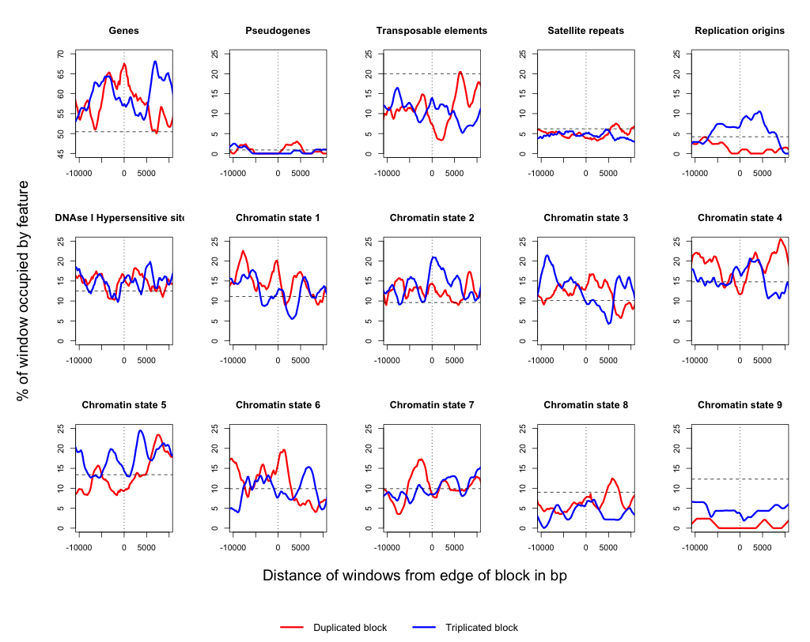

[](http://dx.doi.org/10.5281/zenodo.13237)

# FRAG_project #

## Overview ##

This directory contains code and data files for the Fragmentation project, investigating shattered chromosome phenotypes in _Arabidopsis thaliana_. The original focus of this repository is to develop code to help determine breakpoints between duplicated and triplicated regions of chromosomes (see [Block_detection_code/README.md](Block_detection_code/README.md)) but the focus shifted to write code that will see whether certain genomic features are 
over- or under-represented at either the breakpoint regions or in the blocks themselves.
	

## Generating Data: Making Master GFF file of all genomic features ##

### 1) Get GFF features from TAIR ###

TAIR has separate GFF files for various features on their FTP site (not all in one master file). So:

```bash
cat TAIR10_GFF3_genes_transposons.gff TAIR_GFF3_ssrs.gff > all_TAIR10_features.gff
```
	


### 2) Making replication origin GFF file ###

I wrote a simple script `ori2gff.pl` that takes the raw data from the Gutierrez et al. paper and converts it to a GFF format. E.g. 	

```bash
./ori2gff.pl Gutierrez.txt > Gutierrez_DNA_replication_origin_TAIR10_GBROWSE.gff
```
	
This file will be appended to the main TAIR10 GFF file of all genomic features.

```bash
cat Gutierrez_DNA_replication_origin_TAIR10_GBROWSE.gff  >> all_TAIR10_features.gff
```


### 3) Making DNAse I hypersensitive site GFF file ###

This paper by Zhang et al. (2012) describes a set of hypersensitive sites in *A. thaliana*:

[Genome-Wide Identification of Regulatory DNA Elements and Protein-Binding Footprints Using Signatures of Open Chromatin in Arabidopsis](http://www.plantcell.org/content/24/7/2719.full)

In this paper, they generate DHS maps for seed and flower tissues. These data were submitted to the GEO database and are available under accession [GSE34318](http://www.ncbi.nlm.nih.gov/geo/query/acc.cgi?acc=GSE34318). One of the data files in in BED format (GSE34318_dhsites_region.bed) and this includes the location of DHS regions (presumably after some threshold value has been exceeded) for both leaf and seed tissues.

I extracted just the DHS regions that were identified in wildtype leaf libraries, and converted to GFF.

First quick replacement of spaces with tabs in downloaded bed file and then convert to desired GFF format with simple Perl script:

```bash
tr ' ' '\t' < GSE34318_dhsites_region.bed  | grep wtleaf | sort -k 1,1 -k 2n,2n  > GSE34318_dhsites_region_sorted.bed
./bed2gff.pl GSE34318_dhsites_region_sorted.bed  > DHS.gff
```
	
Now combine with main file:

```bash
cat DHS.gff >> all_TAIR10_features.gff
grep -vE "^#" all_TAIR10_features.gff | sort -k 1,1 -k 4n,4n  all_TAIR10_features.gff > tmp.gff; mv tmp.gff all_TAIR10_features.gff	
```


### 4) Making Chromatin state information GFF file ###

This new paper by Sequeira-Mendes et al. (2014) describes a set of distinct chromatin states in *A. thaliana*: 

[The Functional Topography of the Arabidopsis Genome Is Organized in a Reduced Number of Linear Motifs of Chromatin States](http://www.plantcell.org/content/early/2014/06/11/tpc.114.124578.long)

They mostly use existing histone and other epigenetic modification data, but have some of their own. Using principal components analysis, they end up defining 9 different states of chromatin. These are available in supplemental data file 2 (Excel spreadsheet).

I converted this to a GFF file. Sequence Ontology only has one term for chromatin (SO:0001747 open_chromatin_state) so I will use the 9th column of GFF to distinguish the 9 different states.

First export each tab in Excel spreadsheet to a text file (Windows formatted text), e.g state1.txt, state2.txt etc. Then simple Perl script to convert them to GFF.

```bash
./chromatin_state2gff.pl > tmp.gff
cat tmp.gff >> all_TAIR10_features.gff
sort -k 1,1 -k 4n,4n  all_TAIR10_features.gff > tmp.gff; mv tmp.gff all_TAIR10_features.gff	
```

### Summary of TAIR10 GFF data ###

How many unique features do we have?

```bash
cut -f 2,3 all_TAIR10_features.gff | sort -u
GEO     DNAseI_hypersensitive_site
GutierrezLab    DNA_replication_origin
Sequeira-Mendes_2014_paper      open_chromatin_state
TAIR10  CDS
TAIR10  chromosome
TAIR10  exon
TAIR10  five_prime_UTR
TAIR10  gene
TAIR10  miRNA
TAIR10  mRNA
TAIR10  ncRNA
TAIR10  protein
TAIR10  pseudogene
TAIR10  pseudogenic_exon
TAIR10  pseudogenic_transcript
TAIR10  rRNA
TAIR10  snoRNA
TAIR10  snRNA
TAIR10  three_prime_UTR
TAIR10  transposable_element
TAIR10  transposable_element_gene
TAIR10  transposon_fragment
TAIR10  tRNA
TandemRepeatsFinder_v4.04       satellite
```

Can reorder master GFF file to sort by chromosome and then coordinate:

```bash
(sort -k1,1 -k4n,4n all_TAIR10_features.gff  > tmp) && mv tmp all_TAIR10_features.gff
```


## Generating a GFf file to represent experimental data ##


### Nomenclature and GFF data formats used to represent breakpoint/block data ###

To summarize, we have regions of the genome that have been identified as representing duplicated (or triplicated) 'blocks'. We can represent these regions by using the Sequence Ontology term 'copy_number_gain' (SO:0001742):

<http://www.sequenceontology.org/browser/current_svn/term/SO:0001742>

Each duplicated or triplicated block — henceforth referred to as either 2x or 3x for simplicity — has two ends which define breakpoints. These can be represented with the Sequence Ontology term 'chromosome_breakpoint' (SO:0001021):

<http://www.sequenceontology.org/browser/current_svn/term/SO:0001021>

Each breakpoint has a connected breakpoint (the end of another 2x/3x block). In most cases these pairs of breakpoints will contain intervening sequence that is not present in the reference. Collectively, a pair of breakpoints (and inserted sequence) defines a junction. These could potentially also be represented in Sequence Ontology terms with 'insertion_site' (SO:0000366):

<http://www.sequenceontology.org/browser/current_svn/term/SO:0000366>

Finally, there are also the regions of the genome that punctuate 2x and 3x blocks and which can be thought of as unduplicated regions, or '1x' blocks. These can be represented with the Sequence Ontology term 'region' (SO:0000001):

<http://www.sequenceontology.org/browser/current_svn/term/SO:0000001>


### Making a new GFF file ###

We now need anonymous (and unique) identifiers for blocks and breakpoints. E.g. block0001, breakpoint0001 etc. Each block (copy_number_gain) should connect to two breakpoint objects, and each breakpoint should have a parent block ID, and a paired breakpoint ID. Both blocks and breakpoints will be stored in a single GFF file. 

Example GFF file:


	##gff-version 3
	##species http://www.ncbi.nlm.nih.gov/Taxonomy/Browser/wwwtax.cgi?mode=Info&id=3702
	##genome-build TAIR TAIR10
	#Data from A. thaliana line FRAG00062
	#Generated 20140402
	Chr1	t_test.pl	copy_number_gain	1	205575	.	+	.	ID=block0001;Name=01a1_01a2;Note="duplicated block"
	Chr1	PRICE	chromosome_breakpoint	1	1	.	.	.	ID=breakpoint0001;Parent=block0001;Name=01a1;Note="telomeric end"
	Chr1	PRICE	chromosome_breakpoint	205575	205575	.	-	.	ID=breakpoint0002;Parent=block0001;Name=01a2;Note="paired with breakpoint0033"
	Chr1	t_test.pl	copy_number_gain	31632	87466	.	+	.	ID=block0002;Name=01b1_01b2;Note="triplicated block"
	Chr1	PRICE	chromosome_breakpoint	31632	31632	.	-	.	ID=breakpoint0003;Parent=block0002;Name=01b1;Note="paired with breakpoint0087"
	Chr1    .       region  205575  458539  .       +       .       ID=block0091;Note="no copy number gain detected"


### Treating FRAG00062 data by copy-number level ###

For FRAG00062 we can also separate out the breakpoint data into two subsets, those breakpoints that flank either 2x or 3x blocks:

```bash
grep duplicated FRAG00062.gff   | sed 's/.*ID=\(block[0-9]*\);N.*/\1/' > duplicated_blocks.txt
grep triplicated FRAG00062.gff  | sed 's/.*ID=\(block[0-9]*\);N.*/\1/' > triplicated_blocks.txt
grep -f duplicated_blocks.txt FRAG00062.gff > FRAG00062_2x.gff
grep -f triplicated_blocks.txt FRAG00062.gff > FRAG00062_3x.gff
```


## Analysis: part 1 — Collect some background information about the genome ##


### Checking feature orientation ###

At this point we realized that we would like to know whether the enrichment of genes inside junction regions followed any pattern. I.e. are there more likely to be convergently transcribed genes (hence more 3' UTRs) than divergently or tandemly transcribed genes.

I put only gene features from all_TAIR10_feature.gff into a new file (genes.gff) and made a new script to test this. Running this script with newer breakpoint data for FRAG00062 (90 breakpoints, excluding the 2 that meet telomeres):

```bash
./check_feature_orientation.pl --breakpoint_gff GFF_files/FRAG00062.gff --feature_gff GFF_files/genes.gff --target gene

<<<|<<<	31	%34.44
>>>|>>>	25	%27.78
>>>---|---<<<	4	%4.44
<<<---|--->>>	14	%15.56
<<<---|---<<<	8	%8.89
>>>---|--->>>	8	%8.89

```


Breakpoints inside genes account for 62% of all breakpoints (56/90) and those that are inside divergently transcribed genes account for 41% of all intergenic breakpoints (14/34).

There is a bias when you treat duplicated and triplicated blocks separately:

```bash
./check_feature_orientation.pl --breakpoint_gff GFF_files/FRAG00062_2x.gff --feature_gff GFF_files/genes.gff --target gene
<<<|<<<	16	%36.36
>>>|>>>	15	%34.09
>>>---|---<<<	1	%2.27
<<<---|--->>>	3	%6.82
<<<---|---<<<	4	%9.09
>>>---|--->>>	5	%11.36

./check_feature_orientation.pl --breakpoint_gff GFF_files/FRAG00062_3x.gff --feature_gff GFF_files/genes.gff --target gene
<<<|<<<	15	%32.61
>>>|>>>	10	%21.74
>>>---|---<<<	3	%6.52
<<<---|--->>>	11	%23.91
<<<---|---<<<	4	%8.70
>>>---|--->>>	3	%6.52
```

So for duplicated blocks, ~70% span have a boundary (breakpoint region) which spans a gene, and this drops to ~54% in triplicated blocks.

Now look at for FRAG00045 (30 breakpoints):

```bash
./check_feature_orientation.pl --breakpoint_gff FRAG00045.gff --feature_gff genes.gff --target gene

<<<|<<<	5	%16.67
>>>|>>>	12	%40.00
>>>---|---<<<	3	%10.00
<<<---|--->>>	2	%6.67
<<<---|---<<<	3	%10.00
>>>---|--->>>	5	%16.67
```

This time only 57% of breakpoints were inside genes (17/30) and only 15% of intergenic breakpoints are between divergently transcribed genes. So no strong pattern.


### Data on nearest feature to each breakpoint ###

I wrote a script to calculate the average distance of any genomic feature to each breakpoint. I.e. for every breakpoint find nearest gene/UTR/satellite etc. Then averaged the nearest distances across all breakpoints. 

```bash
./nearest_feature.pl --breakpoint_gff GFF_files/FRAG00062.gff --feature_gff GFF_files/all_TAIR10_features.gff

Feature	Average_distance_to_nearest_breakpoint	Standard_deviation	Number_of_features
CDS	878	2251	53175
DNA_replication_origin	44837	59143	376
DNAseI_hypersensitive_site	1464	2340	10201
chromosome	7407070	3791549	1
exon	565	1162	57655
five_prime_UTR	2283	3049	9240
mRNA	917	1195	9965
miRNA	257654	248174	49
ncRNA	108994	98485	149
non_protein_coding_gene	44618	33137	432
open_chromatin_state_1	3082	3844	3159
open_chromatin_state_2	2532	3145	3838
open_chromatin_state_3	3749	4999	3061
open_chromatin_state_4	2834	3494	4057
open_chromatin_state_5	9209	11022	1900
open_chromatin_state_6	5153	6944	2306
open_chromatin_state_7	12528	15729	1250
open_chromatin_state_8	27134	31662	1275
open_chromatin_state_9	343955	388532	468
protein	1161	2225	9283
protein_coding_gene	1189	2206	7104
pseudogene	116394	230257	233
pseudogenic_exon	116394	230257	327
pseudogenic_transcript	116394	230257	233
satellite	384	482	73206
snRNA	4342430	2745429	2
snoRNA	2116014	2467006	22
tRNA	158832	154954	236
three_prime_UTR	2039	2791	8197
transposable_element	6236	8143	7111
transposable_element_gene	131352	146540	681
transposon_fragment	6236	8143	7862

```

Results are probably biased towards higher density of certain features. I.e. breakpoints are most likely to be nearest a satellite feature, but there are more satellite features than anything else.


### Determine relative levels of enrichment of each feature across the genome ###

For the genome as a whole, and for the 1x, 2x, and 3x regions of Chr1 and Chr4, we can look to see what the levels of any genomic feature are:

```
./determine_background_feature_enrichment.pl --feat GFF_files/all_TAIR10_features.gff --break GFF_files/FRAG00062.gff

genome	CDS		33316212	27.96%
genome	DNA_replication_origin		4968965	4.17%
genome	DNAseI_hypersensitive_site		14889840	12.50%
genome	exon		50129588	42.07%
genome	five_prime_UTR		3147801	2.64%
genome	gene		60130895	50.47%
genome	mRNA		69108726	58.00%
genome	miRNA		40072	0.03%
genome	ncRNA		613554	0.51%
genome	open_chromatin_state_1		13187250	11.07%
genome	open_chromatin_state_2		11378100	9.55%
genome	open_chromatin_state_3		12019350	10.09%
genome	open_chromatin_state_4		17626350	14.79%
genome	open_chromatin_state_5		15961650	13.40%
genome	open_chromatin_state_6		11768100	9.88%
genome	open_chromatin_state_7		11772450	9.88%
genome	open_chromatin_state_8		10747500	9.02%
genome	open_chromatin_state_9		14685000	12.33%
genome	protein		51110375	42.90%
genome	pseudogene		1028312	0.86%
genome	pseudogenic_exon		879013	0.74%
genome	pseudogenic_transcript		1028312	0.86%
genome	rRNA		3944	0.00%
genome	satellite		7378520	6.19%
genome	snRNA		8491	0.01%
genome	snoRNA		7339	0.01%
genome	tRNA		43868	0.04%
genome	three_prime_UTR		4944280	4.15%
genome	transposable_element		23866665	20.03%
genome	transposable_element_gene		9412571	7.90%
genome	transposon_fragment		23276368	19.54%

1x	CDS		2636947	30.64%
1x	DNA_replication_origin		196512	2.28%
1x	DNAseI_hypersensitive_site		1074764	12.49%
1x	exon		3510277	40.78%
1x	five_prime_UTR		231602	2.69%
1x	gene		4764318	55.35%
1x	mRNA		5020785	58.33%
1x	miRNA		4257	0.05%
1x	ncRNA		46150	0.54%
1x	open_chromatin_state_1		907695	10.55%
1x	open_chromatin_state_2		856514	9.95%
1x	open_chromatin_state_3		846702	9.84%
1x	open_chromatin_state_4		1612968	18.74%
1x	open_chromatin_state_5		1500035	17.43%
1x	open_chromatin_state_6		992130	11.53%
1x	open_chromatin_state_7		983582	11.43%
1x	open_chromatin_state_8		687027	7.98%
1x	open_chromatin_state_9		220950	2.57%
1x	protein		4072368	47.31%
1x	pseudogene		74310	0.86%
1x	pseudogenic_exon		68994	0.80%
1x	pseudogenic_transcript		74310	0.86%
1x	rRNA		0	0.00%
1x	satellite		431066	5.01%
1x	snRNA		175	0.00%
1x	snoRNA		220	0.00%
1x	tRNA		3535	0.04%
1x	three_prime_UTR		372553	4.33%
1x	transposable_element		1177628	13.68%
1x	transposable_element_gene		303548	3.53%
1x	transposon_fragment		1151380	13.38%

2x	CDS		5996013	28.38%
2x	DNA_replication_origin		829989	3.93%
2x	DNAseI_hypersensitive_site		2786513	13.19%
2x	exon		8792094	41.62%
2x	five_prime_UTR		593006	2.81%
2x	gene		10811088	51.18%
2x	mRNA		12131821	57.43%
2x	miRNA		4897	0.02%
2x	ncRNA		132958	0.63%
2x	open_chromatin_state_1		2409712	11.41%
2x	open_chromatin_state_2		2159844	10.22%
2x	open_chromatin_state_3		2160505	10.23%
2x	open_chromatin_state_4		3069738	14.53%
2x	open_chromatin_state_5		2870218	13.59%
2x	open_chromatin_state_6		2231773	10.56%
2x	open_chromatin_state_7		2056522	9.74%
2x	open_chromatin_state_8		1709676	8.09%
2x	open_chromatin_state_9		2456250	11.63%
2x	protein		9165224	43.39%
2x	pseudogene		149851	0.71%
2x	pseudogenic_exon		137543	0.65%
2x	pseudogenic_transcript		149851	0.71%
2x	rRNA		0	0.00%
2x	satellite		1448526	6.86%
2x	snRNA		162	0.00%
2x	snoRNA		1596	0.01%
2x	tRNA		11499	0.05%
2x	three_prime_UTR		909821	4.31%
2x	transposable_element		3874226	18.34%
2x	transposable_element_gene		1394862	6.60%
2x	transposon_fragment		3771811	17.86%

3x	CDS		335392	34.37%
3x	DNA_replication_origin		43653	4.47%
3x	DNAseI_hypersensitive_site		174506	17.88%
3x	exon		425912	43.65%
3x	five_prime_UTR		33524	3.44%
3x	gene		589612	60.42%
3x	mRNA		608315	62.34%
3x	miRNA		3635	0.37%
3x	ncRNA		3534	0.36%
3x	open_chromatin_state_1		132509	13.58%
3x	open_chromatin_state_2		146854	15.05%
3x	open_chromatin_state_3		111714	11.45%
3x	open_chromatin_state_4		153183	15.70%
3x	open_chromatin_state_5		154710	15.85%
3x	open_chromatin_state_6		115976	11.88%
3x	open_chromatin_state_7		119057	12.20%
3x	open_chromatin_state_8		48820	5.00%
3x	open_chromatin_state_9		21285	2.18%
3x	protein		507810	52.04%
3x	pseudogene		6088	0.62%
3x	pseudogenic_exon		6088	0.62%
3x	pseudogenic_transcript		6088	0.62%
3x	rRNA		3534	0.36%
3x	satellite		49827	5.11%
3x	snRNA		3534	0.36%
3x	snoRNA		3534	0.36%
3x	tRNA		4114	0.42%
3x	three_prime_UTR		49506	5.07%
3x	transposable_element		84565	8.67%
3x	transposable_element_gene		22846	2.34%
3x	transposon_fragment		83697	8.58%
```
        

So genes occupy about half of the genome. Now let's compare some select features from single-copy, duplicated, and triplicated regions:

```
Feature	1x	2x	3x
DNA_replication_origin	2.28%	3.93%	4.47%
DNAseI_hypersensitive_site	12.49%	13.19%	17.88%
gene	55.35%	51.18%	60.42%
open_chromatin_state_1	10.55%	11.41%	13.58%
open_chromatin_state_2	9.95%	10.22%	15.05%
open_chromatin_state_3	9.84%	10.23%	11.45%
open_chromatin_state_4	18.74%	14.53%	15.70%
open_chromatin_state_5	17.43%	13.59%	15.85%
open_chromatin_state_6	11.53%	10.56%	11.88%
open_chromatin_state_7	11.43%	9.74%	12.20%
open_chromatin_state_8	7.98%	8.09%	5.00%
open_chromatin_state_9	2.57%	11.63%	2.18%
pseudogene	0.86%	0.71%	0.62%
satellite	5.01%	6.86%	5.11%
transposable_element	13.68%	18.34%	8.67%

```

## Analysis: part 2 — look for enriched features around breakpoints ##

### Analysis of enriched features in breakpoint regions ###

If we define a 'breakpoint region' as a window of sequence around each breakpoint location (mapped to the reference genome), we can ask whether any genomic features are enriched in these breakpoint regions. E.g. take 1,000 bp around all breakpoints (potentially overlapping other breakpoints) and ask whether the total bp of a feature such as 'mRNA' is higher (as a percentage) *inside* those regions vs all DNA *outside* those regions.

Can try this for many different sizes of breakpoint region (100 bp up to 10,000 bp). In this analysis certain GFF features (e.g. chromosome) are ignored. The final result is calculated as a ratio of %breakpoint-region-occupied-by-feature compared to %non-breakpoint-region-occupied-by-feature. E.g.

```bash
./overlap_between_two_gff_files.pl --breakpoint_gff GFF_files/FRAG00062.gff  --feature_gff GFF_files/all_TAIR10_features.gff --bp 100

Run	Real_ratio	Bp	Feature	Breakpoint_region_bp	Non_breakpoint_region_bp	Feature_bp_inside	%Inside	Feature_bp_outside	%Outside	Shuffled_ratio	Above	Same	Below
Main run with unshuffled data
0	1.1538	100	CDS	8957	30391295	3021	33.73	8883713	29.23	1.1538	0	0	0
0	0.9602	100	DNA_replication_origin	8957	30391295	300	3.35	1060090	3.49	0.9602	0	0	0
0	1.4907	100	DNAseI_hypersensitive_site	8957	30391295	1749	19.53	3981003	13.10	1.4907	0	0	0
0	1.1745	100	exon	8957	30391295	4367	48.76	12615917	41.51	1.1745	0	0	0
0	1.4388	100	five_prime_UTR	8957	30391295	361	4.03	851345	2.80	1.4388	0	0	0
0	1.1709	100	gene	8957	30391295	5528	61.72	16018929	52.71	1.1709	0	0	0
0	1.1190	100	mRNA	8957	30391295	5802	64.78	17593311	57.89	1.1190	0	0	0
0	0.0000	100	miRNA	8957	30391295	0	0.00	9336	0.03	0.0000	0	0	0
0	0.0000	100	ncRNA	8957	30391295	0	0.00	183696	0.60	0.0000	0	0	0
0	1.2528	100	open_chromatin_state_1	8957	30391295	1275	14.23	3453225	11.36	1.2528	0	0	0
0	2.0914	100	open_chromatin_state_2	8957	30391295	1910	21.32	3098740	10.20	2.0914	0	0	0
0	1.1445	100	open_chromatin_state_3	8957	30391295	1053	11.76	3121797	10.27	1.1445	0	0	0
0	0.9297	100	open_chromatin_state_4	8957	30391295	1309	14.61	4777091	15.72	0.9297	0	0	0
0	0.6906	100	open_chromatin_state_5	8957	30391295	900	10.05	4421550	14.55	0.6906	0	0	0
0	0.9582	100	open_chromatin_state_6	8957	30391295	935	10.44	3310835	10.89	0.9582	0	0	0
0	0.8337	100	open_chromatin_state_7	8957	30391295	769	8.59	3129731	10.30	0.8337	0	0	0
0	0.9982	100	open_chromatin_state_8	8957	30391295	706	7.88	2399744	7.90	0.9982	0	0	0
0	0.1267	100	open_chromatin_state_9	8957	30391295	100	1.12	2677100	8.81	0.1267	0	0	0
0	1.0885	100	protein	8957	30391295	4367	48.76	13612742	44.79	1.0885	0	0	0
0	0.0000	100	pseudogene	8957	30391295	0	0.00	225503	0.74	0.0000	0	0	0
0	0.0000	100	pseudogenic_exon	8957	30391295	0	0.00	207487	0.68	0.0000	0	0	0
0	0.0000	100	pseudogenic_transcript	8957	30391295	0	0.00	225503	0.74	0.0000	0	0	0
0	0.7890	100	satellite	8957	30391295	443	4.95	1905136	6.27	0.7890	0	0	0
0	0.0000	100	snRNA	8957	30391295	0	0.00	337	0.00	0.0000	0	0	0
0	0.0000	100	snoRNA	8957	30391295	0	0.00	2174	0.01	0.0000	0	0	0
0	5.7606	100	tRNA	8957	30391295	26	0.29	15314	0.05	5.7606	0	0	0
0	1.8448	100	three_prime_UTR	8957	30391295	718	8.02	1320573	4.35	1.8448	0	0	0
0	0.5158	100	transposable_element	8957	30391295	771	8.61	5071559	16.69	0.5158	0	0	0
0	0.5994	100	transposable_element_gene	8957	30391295	300	3.35	1698110	5.59	0.5994	0	0	0
0	0.4606	100	transposon_fragment	8957	30391295	671	7.49	4942791	16.26	0.4606	0	0	0
```

The columns of output are as follows:

1. Run number (starts at 0 for unshuffled results)
2. Real ratio from unshuffled data (the ratio of columns 6 & 7)
3. bp of individual breakpoint regions
4. Feature 
5. Breakpoint_region_bp (for small values of bp, this equals number of breakpoints * bp)
6. Non_breakpoint_region_bp      
7. Feature_bp_inside      
8. %Inside 
9. Feature_bp_outside      
10. %Outside        
11. Shuffled_ratio  
12. Above (number of times column 11 exceeds column 2)
13. Same (number of times column 11 equals column 2)   
14. Below (number of times column 11 is below column 2)
15. Asterisks (to denote levels of significance)

To assess the significance of these ratios, I perform shuffling experiments to see whether we see similar ratios when we randomize the location of all of the breakpoints (for the tailswap region we allow the possibility of all junctions occurring in Chr1, or Chr4, or any combination of both, but it is proportional to the length of each region on Chr1 and Chr4).

E.g. if you want to see how significant the above observed enrichment ratio for genes is (1.1709), you could run:

```bash
./overlap_between_two_gff_files.pl --breakpoint_gff GFF_files/FRAG00062.gff  --feature_gff GFF_files/genes.gff --bp 100 --shuffles 1000
```

There will be a row of output generated for each shuffling run. Just want to really look at first run (run = 0) and last run in file. E.g. for genes:

```
Run	Real_ratio	Bp	Feature	Breakpoint_region_bp	Non_breakpoint_region_bp	Feature_bp_inside	%Inside	Feature_bp_outside	%Outside	Shuffled_ratio	Above	Same	Below
Main run with unshuffled data
0	1.1709	100	gene	8957	30391295	5528	61.72	16018929	52.71	1.1709	0	0	0
1000	1.1709	100	gene	9000	30391252	4738	52.64	16019719	52.71	0.9987	32	0	968	*
```

This suggests that the observed enrichment ratio (1.1709) was only exceeded in 32 out of 1000 shuffles (suggesting P < 0.05). Ideally, we want to do this for most genome features, but look separately at 2x and 3x regions (for FRAG00062), and use different sizes of breakpoint regions. We'll make a subset GFF file to only contain the GFF features we might be most interested in (which also removes similar features (e.g. mRNA/CDS/exon/protein):

```bash
cat genes.gff DHS.gff chromatin_states.gff pseudogene.gff replication_origins.gff satellite.gff state?.gff transposable_element.gff > subset_TAIR10_features.gff
```


E.g. set up lots of runs with a bash script:

```bash
#!/bin/bash

for i in 100 1000 10000;
do
	echo "./overlap_between_two_gff_files.pl --breakpoint_gff GFF_files/FRAG00062_2x.gff --feature_gff GFF_files/subset_TAIR10_features.gff --verbose --bp $i --shuffles 1000 > Results/FRAG00062_2x_${i}bp_S1000.tsv \& ";
	./overlap_between_two_gff_files.pl       --breakpoint_gff GFF_files/FRAG00062_2x.gff --feature_gff GFF_files/subset_TAIR10_features.gff --verbose --bp $i --shuffles 1000 > Results/FRAG00062_2x_${i}bp_S1000.tsv \& 

	echo "./overlap_between_two_gff_files.pl --breakpoint_gff GFF_files/FRAG00062_3x.gff --feature_gff GFF_files/subset_TAIR10_features.gff --verbose --bp $i --shuffles 1000 > Results/FRAG00062_3x_${i}bp_S1000.tsv \& ";
	./overlap_between_two_gff_files.pl       --breakpoint_gff GFF_files/FRAG00062_3x.gff --feature_gff GFF_files/subset_TAIR10_features.gff --verbose --bp $i --shuffles 1000 > Results/FRAG00062_3x_${i}bp_S1000.tsv \& 

done
```

Here are the principle results for FRAG00062 (duplicated and triplicated regions) using a breakpoint region size of 1 Kbp with 1000 shuffles. The last 3 columns of output count how many times the observed ratio from the real data was exceeded, equalled, or not exceeded/equalled in the 1000 shufflings (2x results on top):


```bash
tail -n 15 Results/FRAG00062_2x_1000bp_S1000.tsv | cut -f 2,4,12-15; echo; tail -n 15 Results/FRAG00062_3x_1000bp_S1000.tsv | cut -f 2,4,12-15
0.0000	DNA_replication_origin	895	105	0
1.3428	DNAseI_hypersensitive_site	69	0	931
1.3201	gene	3	0	997	**
1.5493	open_chromatin_state_1	64	0	936
1.7623	open_chromatin_state_2	20	0	980	*
1.4253	open_chromatin_state_3	143	0	857
0.6846	open_chromatin_state_4	855	0	145
0.5691	open_chromatin_state_5	897	0	103
1.4304	open_chromatin_state_6	141	0	859
0.7294	open_chromatin_state_7	754	0	246
0.9734	open_chromatin_state_8	496	0	504
0.0000	open_chromatin_state_9	982	18	0
0.0000	pseudogene	478	522	0
0.5827	satellite	954	0	46	*
0.3211	transposable_element	995	0	5	**

1.8201	DNA_replication_origin	152	0	848
1.4486	DNAseI_hypersensitive_site	39	0	961	*
1.0435	gene	353	0	647
1.0512	open_chromatin_state_1	424	0	576
2.2517	open_chromatin_state_2	3	0	997	**
0.8549	open_chromatin_state_3	638	0	362
1.1487	open_chromatin_state_4	302	0	698
0.8663	open_chromatin_state_5	644	0	356
0.7125	open_chromatin_state_6	784	0	216
0.7952	open_chromatin_state_7	673	0	327
0.8184	open_chromatin_state_8	646	0	354
0.3712	open_chromatin_state_9	921	0	79
0.0000	pseudogene	524	476	0
0.8774	satellite	593	0	407
0.8176	transposable_element	729	0	271

```

There is a striking difference in the ratios of replication origins, and to a lesser-extent to gene-related features. Breakpoints that flank duplicated (2x) blocks are more likely to be enriched for gene-related features, but triplicated blocks (3x) have more replication origins (though this may not be significant).

	
##### Conclusion 1: significant enrichment of genes mostly occurs in 2x regions #### 

##### Conclusion 2: enrichment of replication origins only occurs in 3x regions ####


### FRAG00045 results

The FRAG00045 line only consists of duplicated blocks, so no 3x regions are present. In the 1 Kbp region result file, no significantly enriched features are detected apart from open_chromatin_state_5 (P < 0.05):

```bash
tail -n 30 Results/FRAG00045_1000bp_S1000.tsv | cut -f 2,4,12-15
1.0529  CDS     396     1       603
0.9543  DNA_replication_origin  367     187     446
1.4364  DNAseI_hypersensitive_site      86      0       914
1.0002  exon    492     0       508
1.7759  five_prime_UTR  96      0       904
1.0242  gene    460     0       540
0.9807  mRNA    560     0       440
0.0000  miRNA   43      957     0
0.0000  ncRNA   251     749     0
1.2696  open_chromatin_state_1  268     0       732
1.6674  open_chromatin_state_2  80      0       920
0.8545  open_chromatin_state_3  610     0       390
0.7135  open_chromatin_state_4  777     0       223
1.7146  open_chromatin_state_5  49      0       951     *
0.4890  open_chromatin_state_6  877     0       123
0.8223  open_chromatin_state_7  589     0       411
0.6663  open_chromatin_state_8  711     1       288
0.5221  open_chromatin_state_9  761     0       239
1.0012  protein 534     0       466
0.0000  pseudogene      351     649     0
0.0000  pseudogenic_exon        350     650     0
0.0000  pseudogenic_transcript  351     649     0
0.6445  satellite       849     0       151
0.0000  snRNA   0       1000    0
0.0000  snoRNA  16      984     0
0.0000  tRNA    190     810     0
1.0760  three_prime_UTR 400     0       600
0.4224  transposable_element    959     0       41      *
0.4991  transposable_element_gene       745     2       253
0.4334  transposon_fragment     949     0       51
```


#### Conclusion 3: not all FRAG lines may exhibit the same patterns of feature enrichment ####


# Analysis: part 3: look at frequency of genes and replication origins near breakpoints


## Count breakpoints that contain features of interest ##

Now that we have a good idea about the pattern of genes and replication origins in breakpoint regions, I wanted to more simply ask 'how many breakpoint regions' contain at least 1 gene or replication origin (simply overlapping by a single bp counts as 'contained' in this case). Previously we are looking at the total amount of bp that a feature occupies in breakpoint regions, but maybe just knowing that 'at least one' feature is in a breakpoint region is enough?

For this analysis, I combined just the gene and replication origins into a new GFF file. We are really interested in comparing 2x and 3x breakpoint regions, and testing different sizes of breakpoint regions:

```bash
# 100 bp
./count_breakpoints_with_features.pl --breakpoint_gff GFF_files/FRAG00062_2x.gff --feature_gff GFF_files/genes_and_origins.gff --bp 100
FINAL: 0/44 breakpoint regions (0.0%) overlap with DNA_replication_origin
FINAL: 32/44 breakpoint regions (72.7%) overlap with gene

./count_breakpoints_with_features.pl --breakpoint_gff GFF_files/FRAG00062_3x.gff --feature_gff GFF_files/genes_and_origins.gff --bp 100
FINAL: 3/46 breakpoint regions (6.5%) overlap with DNA_replication_origin
FINAL: 26/46 breakpoint regions (56.5%) overlap with gene

# 1000 bp
./count_breakpoints_with_features.pl --breakpoint_gff GFF_files/FRAG00062_2x.gff --feature_gff GFF_files/genes_and_origins.gff --bp 1000
FINAL: 0/44 breakpoint regions (0.0%) overlap with DNA_replication_origin
FINAL: 37/44 breakpoint regions (84.1%) overlap with gene

./count_breakpoints_with_features.pl --breakpoint_gff GFF_files/FRAG00062_3x.gff --feature_gff GFF_files/genes_and_origins.gff --bp 1000
FINAL: 5/46 breakpoint regions (10.9%) overlap with DNA_replication_origin
FINAL: 35/46 breakpoint regions (76.1%) overlap with gene

# 10,000 bp
./count_breakpoints_with_features.pl --breakpoint_gff GFF_files/FRAG00062_2x.gff --feature_gff GFF_files/genes_and_origins.gff --bp 10000
FINAL: 4/44 breakpoint regions (9.1%) overlap with DNA_replication_origin
FINAL: 43/44 breakpoint regions (97.7%) overlap with gene

./count_breakpoints_with_features.pl --breakpoint_gff GFF_files/FRAG00062_3x.gff --feature_gff GFF_files/genes_and_origins.gff --bp 10000
FINAL: 17/46 breakpoint regions (37.0%) overlap with DNA_replication_origin
FINAL: 44/46 breakpoint regions (95.7%) overlap with gene
```

#### Conclusion 4a: Breakpoint regions of 10 Kbp or larger are almost certain to contain at least one gene (in either 2x or 3x data sets)	

#### Conclusion 4b: The majority of 3x breakpoint regions do *not* contain replication origins, however they are more likely to contain them than 2x breakpoint regions


# Analysis: part 4: look at change in frequency of features around the breakpoint


### Find bias of certain genomic features around 2x and 3x breakpoints ###

Finally, I wrote a script that uses a sliding window that moves across the breakpoint region (starting upstream of the breakpoint and moving along in a stepped window fashion). The range (+/- x bp) can be specified with --range option, the window size is specified with --bin, and the step size with --step.

By default the script will not distinguish between the fact that the upstream region of a breakpoint at the 5' edge of duplicated/triplicated block is *outside* the block, whereas the same upstream region at the 3' block breakpoint is *inside* the block.

To more fairly address this and make sure like is being compared with like, I added a --flip option. When this is turned on, coordinates for breakpoints at the 3' block breakpoint are 'flipped', e.g. a 100 bp window of sequence that occurs at +500–600 bp downstream from the breakpoint will be reported as occurring at -500–600 bp.

	
The raw output for this focuses on the percentage of bp inside the sliding window that are occupied by the selected genomic feature, when averaged across *all* breakpoints. This is what will be plotted. The script also records the opposite result (percentage of bp outside the sliding windows that are occupied by the feature). E.g. some sample output for genes at the 2x breakpoint boundary:

```bash

./find_bias_around_breakpoints.pl --break GFF_files/FRAG00062_2x.gff --feat GFF_files/genes.gff --flip  --bin 1000 --step 100 --range 2000 --flip

Start	End	Midpoint	Breakpoint_bp	Non_breakpoint_bp	Feature_bp_inside	%Inside	Feature_bp_outside	%Outside	Ratio
-2000	-1000	-1500	40708	46859319	25295	62.14	15890454	33.91	1.8324
-1900	-900	-1400	40508	46859519	24875	61.41	15890874	33.91	1.8108
-1800	-800	-1300	40308	46859719	24476	60.72	15891273	33.91	1.7906
-1700	-700	-1200	40108	46859919	24317	60.63	15891432	33.91	1.7878
-1600	-600	-1100	40210	46859817	24343	60.54	15891406	33.91	1.7852
-1500	-500	-1000	40530	46859497	24944	61.54	15890805	33.91	1.8149
-1400	-400	-900	40730	46859297	25626	62.92	15890123	33.91	1.8554
-1300	-300	-800	40930	46859097	26179	63.96	15889570	33.91	1.8862
-1200	-200	-700	41130	46858897	26821	65.21	15888928	33.91	1.9232
-1100	-100	-600	41151	46858876	27457	66.72	15888292	33.91	1.9678
-1000	0	-500	43018	46858009	28682	66.67	15887067	33.90	1.9665
-900	100	-400	41218	46858809	28080	68.13	15887669	33.91	2.0093
-800	200	-300	41418	46858609	28492	68.79	15887257	33.90	2.0290
-700	300	-200	41618	46858409	28798	69.20	15886951	33.90	2.0409
-600	400	-100	41818	46858209	28974	69.29	15886775	33.90	2.0436
-500	500	0	42000	46858027	28746	68.44	15887003	33.90	2.0187
-400	600	100	42000	46858027	28464	67.77	15887285	33.91	1.9989
-300	700	200	42000	46858027	28364	67.53	15887385	33.91	1.9918
-200	800	300	42000	46858027	28375	67.56	15887374	33.91	1.9926
-100	900	400	42000	46858027	28283	67.34	15887466	33.91	1.9861
0	1000	500	44000	46856027	28683	65.19	15887066	33.91	1.9226
100	1100	600	42000	46858027	28034	66.75	15887715	33.91	1.9686
200	1200	700	42000	46858027	27619	65.76	15888130	33.91	1.9394
300	1300	800	42000	46858027	27163	64.67	15888586	33.91	1.9073
400	1400	900	42000	46858027	26666	63.49	15889083	33.91	1.8724
500	1500	1000	42000	46858027	26160	62.29	15889589	33.91	1.8368
600	1600	1100	42000	46858027	25731	61.26	15890018	33.91	1.8066
700	1700	1200	42000	46858027	25537	60.80	15890212	33.91	1.7930
800	1800	1300	42000	46858027	25393	60.46	15890356	33.91	1.7829
900	1900	1400	42000	46858027	25257	60.14	15890492	33.91	1.7733
1000	2000	1500	42000	46858027	25021	59.57	15890728	33.91	1.7567
```

In this scenario, the proportion of all window bp that contain gene features peaks (69.29%) when the window is centered just upstream of the breakpoint (at -200 bp). As the window moves away from the breakpoint the density of gene features drops.

Some genomic features have biases around the breakpoints that are best visualized using a different scale (i.e. larger bin sizes). To best address this I performed analysis of each dataset using 3 different window sizes (100 bp, 500 bp, and 2,000 bp) with step size always set to 10% of window size. I calculate results from -25,000 to +25,000 bp from the breakpoint even though the full extent of these ranges will not always be plotted.

To automate this, we ideally need separate GFF files for various individual features:

```bash
grep -w transposable_element all_TAIR10_features.gff  > transposable_element.gff
grep -w pseudogene all_TAIR10_features.gff > pseudogene.gff
grep "Note=\"state1" all_TAIR10_features.gff > state1.gff
grep "Note=\"state2" all_TAIR10_features.gff > state2.gff
grep "Note=\"state3" all_TAIR10_features.gff > state3.gff
grep "Note=\"state4" all_TAIR10_features.gff > state4.gff
grep "Note=\"state5" all_TAIR10_features.gff > state5.gff
grep "Note=\"state6" all_TAIR10_features.gff > state6.gff
grep "Note=\"state7" all_TAIR10_features.gff > state7.gff
grep "Note=\"state8" all_TAIR10_features.gff > state8.gff
grep "Note=\"state9" all_TAIR10_features.gff > state9.gff
grep -w satellite all_TAIR10_features.gff > satellite.gff	
```

Use bash looping script to generate final set of result files:

```bash
#!/bin/bash

for feature in genes pseudogene transposable_element satellite replication_origins DHS state1 state2 state3 state4 state5 state6 state7 state8 state9
do
	for window in 2000 500 100
	do
		let "step=$window/10"
		echo "Running: $feature $window $step"
		echo "./find_bias_around_breakpoints.pl --break GFF_files/FRAG00062_2x.gff --feat GFF_files/${feature}.gff --flip  --bin $window --step $step > Results/FRAG00062_2x_bias_data_${feature}_${window}_${step}_flipped.tsv &"
		./find_bias_around_breakpoints.pl --break GFF_files/FRAG00062_2x.gff --feat GFF_files/${feature}.gff --flip  --bin $window --step $step > Results/FRAG00062_2x_bias_data_${feature}_${window}_${step}_flipped.tsv &

		echo "./find_bias_around_breakpoints.pl --break GFF_files/FRAG00062_3x.gff --feat GFF_files/${feature}.gff --flip  --bin $window --step $step > Results/FRAG00062_3x_bias_data_${feature}_${window}_${step}_flipped.tsv &"
		./find_bias_around_breakpoints.pl --break GFF_files/FRAG00062_3x.gff --feat GFF_files/${feature}.gff --flip  --bin $window --step $step > Results/FRAG00062_3x_bias_data_${feature}_${window}_${step}_flipped.tsv &
		echo
	done
done
```
	
In many ways it is more useful to plot the over- or under-enrichment of certain features in relation to the level of that feature across the whole genome. For plotting purposes, can add data from determine_background_feature_enrichment.pl script.

An R script (`breakpoint_analysis_main_figure.R`) can be used to plot the main figure comparing genes and replication origins around breakpoints in FRAG00062 (2x vs 3x). Two other R scripts were used to produce similar plots for 16 different genome features at two different window sizes (`breakpoint_analysis_supplemental_figure_500_50.R` and
`breakpoint_analysis_supplemental_figure_2000_200.R`).


### Final results ###

In the plots below, the dotted vertical line indicates position of breakpoint (edge of 2x or 3x block) and dashed horizontal lines indicate background genome level of the feature.

The y-axes on all plots show a 25% range, in order to facilitate comparison between plots. Genes are the only feature which have a y-axis that does not start at 0%.

####  Main plot: genes and replication origins ####


#### Supplemental plot 1: 16 different features, window = 500 bp ####


#### Supplemental plot 2: 16 different features, window = 2,000 bp ####

